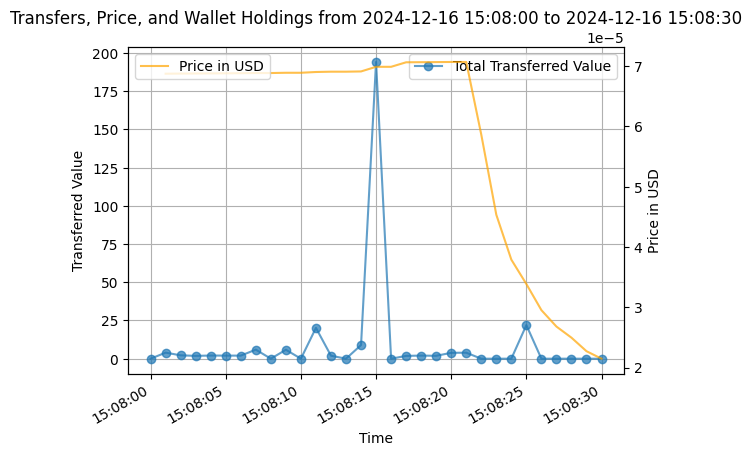

# TokenAnalysis

This repository contains tools designed to analyze solana tokens that have been rugpulled, by collecting and processing data on market capitalization, top holders, and transfers.

# How to Use

First we need to get the data for the analysis. Holders and market cap data are taken in real-time (I'm searching another way to do it, because it consumes a lot of bitquery credits).

### Setting up token addres and bitquery credentials

Create a .env file with the variables BITQUERY_ACCESS_TOKEN and MINT_ADDRESS, example:
```
BITQUERY_ACCESS_TOKEN=xxxxxxxxxxxxxx
MINT_ADDRESS=xxxxxxxxxxxx
```

### Holders data (WIP)

Get top holders data with `python get_top_holders.py`

### MkCap data

Get market cap data with `python get_market_cap.py`


### Transfer data

Solscan makes it very easy to get the transfer data in csv and its free. Since we only want the transfers from wallet to wallet, we have to filter out the transfers to pumpfun. 

The only problem is that we cannot filter out one wallet in solscan, so I've made a workaround: 

1. Go to the tranfers section and export to csv
2. Filter by transfers To (wallet of pumpfun) and export to csv

Use `filter_transfers.ipynb`. This script will create a new csv from the first csv exported, removing every row that appears in the second. 


# Example Data

The example data has been taken from this token: [DUCKEY](https://solscan.io/token/45jBd1sQWuSr2dbTBgjb168xaA6De78rLVUvQ2Zmpump)

# Example Analysis


